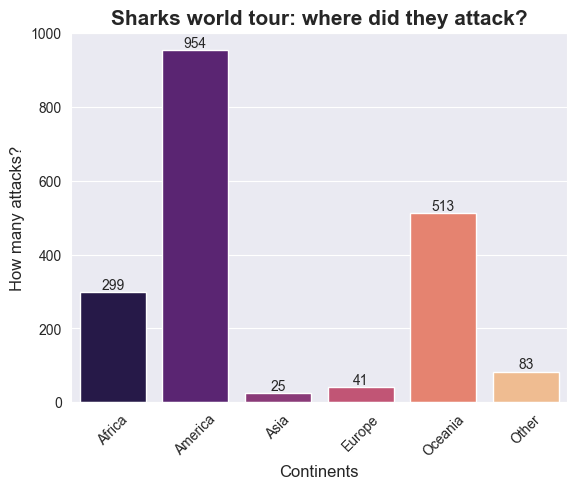

# Project: SHARKS ATTACK!!

**# Table of Contents**
* [What is this about? (Project Description)]
* [What do we have? (Data obtention)]
* [Is there anything interesting? (Hipothesis making)]
* [Let the cleaning start! (EDA)]
* [Getting some results (Visualization)]
* [Let's be fare about it (Strengths and Weaknesses)]
* [To wrap up (Conclusions)]

## What is this about?
This analysis is based on the famous ‘Shark Attack’ dataframe. It comprises several variables related to shark attacks worldwide. Well known it is the importance of sharks, their role in Nature, their predator character… however, some questions still lie deep underwater. Should we try to dig deeper in how these attacks look like?

# What do we have? 
After opening the raw csv file, we can see the different variables we have to make our analysis. Let's make a brief interpretation of them! 

**Case number**: *attack identifier (number)*
**Date**: *date when the attack happened*
**Year**: *year when the attack happened*
**Type**: *type of attack (was it provoked? accidental? etc.)*
**Country**: *country where the attack took place*
**Area**: *area/state where the attack took place*
**Location**: *city/town where the attack took place*
**Activity**: *activity the victim was doing when attacked*
**Name**: *name of the victim*
**Sex**: *sex of the victim (male/female)*
**Age**: *age of the victim (years)*
**Injury**: *type of injury (location, seriousness)*
**Fatal**: *the attack was fatal (death) or not*
**Hour**: *hour when the attack took place*
**Specie**: *type of shark (white shark, tiger shark, etc.)*
**Investigator or Source**: *information on the investigator*
**PDF**: *pdf information on the investigator*
**href formula**: *URL to access the data*
**href**: *URL to access the data*
**Case number**: *case number*
**Original order**: *original order*
**Unnamed 22 y Unnamed 23**: *empty columns (no data)*

So…maybe next step is to check them carefully to see which of those are relevant for our analysis? By looking at them, some look very similar, some very messy (such as species, url, etc.). We need to carefully consider the hypothesis we are going to make and which variables we need for that (no need to carefully clean at this point! We can miss a lot of data!). 

# Is there anything interesting?

By carefully considering the variables we have and the data contained in each of them…we are going to talk about a few relevant hypothesis:

**Hipothesis 1**: *Are attacks international? How much do sharks like attacking worldwide? Do they consider maybe people from specific places specially tasty?*

**Hipothesis 2**: *Do sharks agree with Becky G and like them elder? Also do they any preferences on gender? Attack trends by age and sex*

**Hipothesis 3**: *Is Jaws accurate?  Which shark specie attacks the most?*

## So...how are we going to do all that?

First of all, we must make a copy of the dataset in order to use the version we are going to clean up (in our case, 'attack_clean'). Secondly, we need to have a grasp of the data we have. Not only the variables but also the values (and missing values!):

* Do we have empty variables? or duplicated? 
* Do we have messy information that can be re-written to have more consistency? 
* What type of data we have?(integers, floats, strings, objects,etc.)

We start having a dataset of almost 26,000 rows and 24 columns. After applying visualization commands (such as df.info(), df.sample(), df.tail(), pd.isnull()) we observe there is almost 70% of missing data! 
** Steps:
- Create a function that shows how many columns have more than 90% data missing.  
- Check the rows that have 80% missing data or more (based on the length of the row - number of variables)
- Values were replaced for the correct value if possible to guess. Otherwise, the value was dropped

After this cleaning, the number of missing values in the dataframe was considerably lower! 

Other types of cleaning and analysis were performed, such as renaming variables (using the 'replace' command), changing the type of the data (e.g. age and year were float and were transformed to integers with the 'astype' command).

Finally, a reset index was made in order to have it ordered. The clean dataframe was saved into an excel file to keep it.

# Getting some results
Now we have a fairly general cleaning, we can start thinking about the hypothesis solving. A subset was created with the variables that could be related to the first hypothesis testing and called 'hip1', 'hip2', 'hip3' depending on the questions we wanted to anwer.

### **Hipothesis 1**: *Are attacks international? How much do sharks like attacking worldwide? Do they consider maybe people from specific places specially tasty?*

First checked the variable country. By looking at the unique values, it has many different country names. This will result in graphs that are complicated to interpret. Hence an approach by continent was made instead. A function was created where lists with all countries per continent were created (source: WHO). These were treated to have the specific format in strings for each country. Then, a for loop was created so that for each value in the country column from the dataset the specific continent was returned using a lambda. Other countries not included in the lists were named as ‘Other’ so that they can be analysed more specifically.

def continente(pais):
    asia=['Kazakhstan', 'Kyrgyzstan', 'Tajikistan', 'Turkmenistan', 'Uzbekistan', 'China', 'Korea', 'Japan', 'Mongolia', 'Afghanistan', 'Bangladesh', 'Bhutan', 'India', 'Iran', 'Maldives', 'Nepal', 'Pakistan', 'Sri Lanka','Brunei', 'Darussalam', 'Cambodia', 'Indonesia', 'Lao', 'Malaysia', 'Myanmar', 'Philippines', 'Singapore', 'Thailand', 'Timor-Leste', 'Viet Nam', 'Armenia', 'Azerbaijan', 'Bahrain', 'Cyprus', 'Georgia', 'Iraq', 'Israel', 'Jordan', 'Kuwait', 'Lebanon', 'Oman', 'Qatar', 'Saudi Arabia', 'Palestine', 'Syria', 'Turkey', 'United Arab Emirates', 'Yemen']
    europe= ['Albania' ,'Andorra' ,'Austria' ,'Belarus' ,'Belgium' ,'Bosnia Herzegovina' ,'Bulgaria' ,'Croatia' ,'Cyprus' ,'Czech' ,'Denmark' ,'Estonia' ,'Finland' ,'France' ,'Germany' ,'Greece' ,'Hungary' ,'Iceland' ,'Ireland' ,'Italy' ,'Latvia' ,'Liechtenstein' ,'Lithuania' ,'Luxembourg' ,'Malta' ,'Moldova' ,'Monaco' ,'Montenegro' ,'Netherlands' ,'North' ,'Macedonia' ,'Norway' ,'Poland' ,'Portugal' ,'Romania' ,'Russia' ,'San Marino' ,'Serbia' ,'Slovakia' ,'Slovenia' ,'Spain' ,'Sweden' ,'Switzerland' ,'Ukraine' ,'United Kingdom']
    africa=['Lesotho', 'Swaziland', 'Botswana', 'Namibia', 'South Africa', 'Angola', 'Cameroon', 'Equatorial Guinea', 'Gabon', 'Congo', 'Chad', 'Central African Republic', 'Congo', 'Sao Tome and Principe', 'Burundi', 'Eritrea', 'Madagascar', 'Reunion', 'Somalia', 'Comoros', 'Ethiopia', 'Rwanda', 'Djibouti', 'Kenya', 'Mayotte', 'Seychelles', 'Uganda', 'Mozambique', 'Zambia', 'Malawi', 'Tanzania', 'Zimbabwe', 'Benin', 'Liberia', 'Saint Helena', 'Burkina Faso', 'Gambia', 'Mali', 'Ghana', 'Mauritania', 'Senegal', 'Cape Verde', 'Cote Divoire', 'Guinea', 'Niger', 'Sierra Leone', 'Guinea-Bissau', 'Nigeria', 'Togo', 'Algeria', 'Egypt', 'Libyan ', 'Morocco', 'Tunisia', 'Sahara', 'Sudan']
    america=['Anguilla', 'Antigua and Barbuda', 'Argentina', 'Aruba', 'Bahamas', 'Bajo Nuevo Bank', 'Barbados', 'Belize', 'Bermuda', 'Bolivia', 'Bonaire', 'Brazil', 'British Virgin Islands', 'Canada', ' Cayman Islands', 'Chile', ' Clipperton Island', 'Colombia', ' Costa Rica', 'Cuba', 'Curaçao', 'Dominica', ' Dominican Republic', 'Ecuador', ' El Salvador', ' Falkland Islands', ' Federal Dependencies of Venezuela', ' French Guiana', 'Greenland', 'Grenada', 'Guadeloupe ', 'Guatemala', 'Guyana', 'Haiti', 'Honduras', 'Jamaica', 'Martinique', 'Mexico', 'Montserrat', 'Navassa Island', 'Nicaragua', 'Panama', 'Paraguay', 'Peru', ' Puerto Rico', 'Saba', ' Saint Barthélemy', 'Saint Kitts and Nevis', ' Saint Lucia', ' Saint Martin', ' Saint Pierre and Miquelon', ' Saint Vincent and the Grenadines', 'Serranilla Bank', ' Sint Eustatius', ' Sint Maarten', 'South Georgia', 'South Sandwich Islands', 'Suriname', ' Trinidad and Tobago', 'Turks and Caicos Islands', 'United States of America', 'USA', 'U.S.A.', ' U.S. Virgin Islands', 'Uruguay', 'Venezuela']
    oceania=['Australia', 'Fiji', 'Kiribati', 'Marshall Islands', 'Micronesia', 'Nauru', 'New Zealand', 'Palau', 'Papua New Guinea', 'Samoa', 'Solomon Islands', 'Tonga', 'Tuvalu', 'Vanuatu']

    if pais in asia:
        return "Asia"
    elif pais in europe:
        return "Europe"
    elif pais in africa:
        return "Africa"
    elif pais in america:
        return "America"
    elif pais in oceania:
        return "Oceania"
    else:
        return "Other"
    
  hip1['Continente'] = hip1['Country'].apply(lambda x: continente(x))  

Also, other values were checked to see if there was missing data on them. Age has loads of missing data so imputation was dismissed in order to get estimates that are not representative. Values were dropped instead, as the N of observations is still high and representative. 

Then values were grouped by continent and age to see how results look like. A variable n_attacks was created and equal to 1 (1 attack per observation). A boxplot was constructed with Seaborn in order to graphically plot the results. Axis and legend were adapted in size as well as the grid to make the graph easier to interpret. Most attacks were made in America, followed by Oceania and Africa. The whole America, Oceania and Africa are places full of surfists, so tasty for them! Probably sharks know they are famous in northamerican beaches and that can earn loads of money attacking there??

### **Hipothesis 2**: *Do sharks agree with Becky G and like them elder? Also do they any preferences on gender? Attack trends by age and sex*

Sound is propagated more quickly and easily underwater. So what about music? Has already reggaeton arrived to the oceans and sharks like Becky G songs? The second hypothesis tries to prove whether attacks are more common on older people. A second subset (hip2) was created as a copy of the first subset (hip1).

Again we face the problem of having many different ages. We check the unique values of age to check they are reasonable (e.g. not negative numbers or values upper than 120 years). Age categories were created using the function xxx that loops each value of the column age and includes it in a specific age group. A second function was also created (more general) to include the age in a specific string category (teenager, early adult, adult, elder, very old). 

def grupedad_cat(edad):
    if edad <12:
        return "Child"
    elif edad <=13:
        return "Teen"
    elif edad <=30:
        return "Early Adult"
    elif edad <=60:
        return "Adult"
    elif edad <=80:
        return "Old"
    elif edad >80:
        return "Very old"
    else:
        return "not a number"
    
hip2['Grupedad_cat'] = hip2['Age'].apply(lambda x: grupedad_cat(x))

To show this graphically, a boxplot was made, showing that values fall mainly in the adult category and values go from 5 years to xx. It also shows some outliers (elder people) who were also bitten. 

To check the sex, the variable was cleaned looking at unique values. Some of them were converted using the replace method (if they were clear enough). Others were dropped if not clear enough (only xx were dropped). A histogram was made checking not only age groups by also sex. It is clearly showns that men were more attacked than women. Interesting results…less ability to swim? More unconscious? Weaker? 😊 
Values range from x to x and from x to x in men and women. Skewed? Etc. 

### **Hipothesis 3**: *Is Jaws accurate?  Which shark specie attacks the most?*

Finally the last hypothesis was done by checking how many times a specific specie was repeated. The column was quite messy (free text cell) so regex was employed to detect the word immediately before the word ‘Shark’. This worked fairly well. In the cases were a non-specie word was obtained the observation was included as ‘Other’ in order to obtain a data robust subset and not dropping.  With this information, a wordcloud was presented using the shark. The conclusion is clear: **Jaws was accurate**. The **white shark** is the most letal shark (attackswise).

